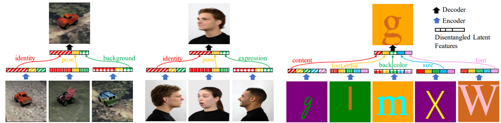
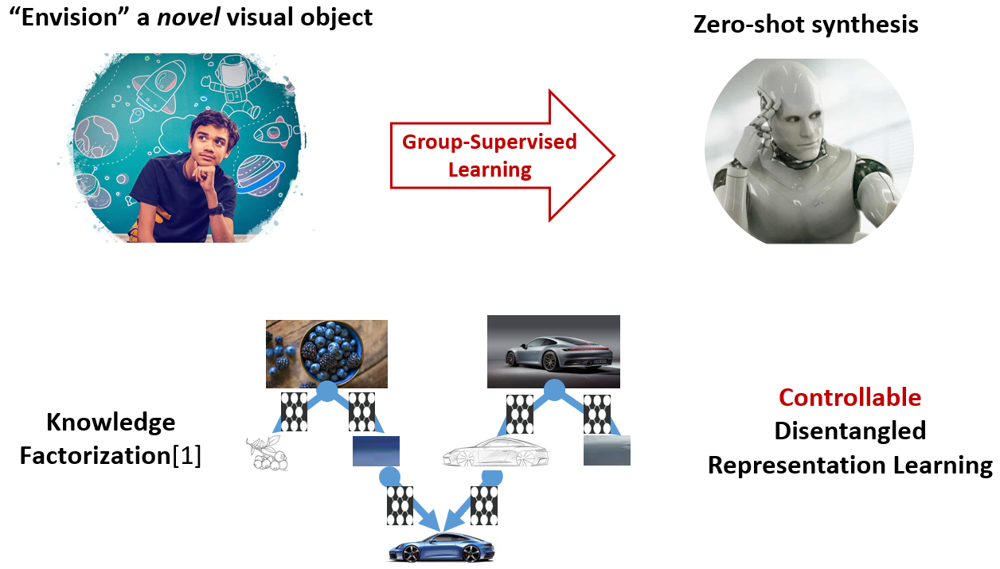

# GSL - Zero-shot Synthesis with Group-Supervised Learning



**Figure:** *Zero-shot synthesis performance of our method with different dataset (iLab-20M, RaFD, and Fonts). Bottom: training images (attributes are known). Top:
Test image (attributes are a query).*

> **Zero-shot Synthesis with Group-Supervised Learning** <br>
> Yunhao Ge, Sami Abu-El-Haija, Gan Xin, Laurent Itti <br>
> *International Conference on Learning Representations (ICLR), 2021*

[[Paper](https://openreview.net/pdf?id=8wqCDnBmnrT)]
[[Project Page](http://sami.haija.org/iclr21gsl)]
[[Fonts dataset](http://ilab.usc.edu/datasets/fonts)]

To aid neural networks to envision objects with different attributes, we propose a family of objective functions, expressed on *groups of examples*, as a *novel learning framework* that we
term **Group-Supervised Learning** (GSL). 
GSL allows us to decompose inputs into a disentangled representation with swappable components, that can be recombined to synthesize new samples.
(*i.e.*, images of red boats & blue cars can be decomposed and recombined to synthesize novel images of red cars.

[We are actively updating the code]


## Getting Started

### Installation

- Dependencies
```
python 3.6.4
pytorch 0.3.1.post2
visdom
tqdm
```
<br>

- Clone this repo:
```bash
git clone https://github.com/junyanz/pytorch-CycleGAN-and-pix2pix
cd pytorch-CycleGAN-and-pix2pix
```

### Datasets
- iLab-20M, is an attributed dataset containing images of toy vehicles placed
on a turntable using 11 cameras at different viewing points. There are 3 attribute classes: vehicle
identity: 15 categories, each having 25-160 instances; pose; and backgrounds: over 14 for each
identity: projecting vehicles in relevant contexts. You can download a subset of iLab-20M that we used in our paper here: [iLab-6pose](http://ilab.usc.edu/datasets/iLab_6pose.zip)

- Fonts, is a computer-generated RGB image datasets. Each image, with 128 * 128 pixels, contains an alphabet letter rendered using 5 independent generating attributes: letter identity, size, font color, background color and font.
you can download the fonts dataset at here: [Fonts](http://ilab.usc.edu/datasets/fonts).

- RaFD contains pictures of 67 models displaying 8 emotional expressions taken by 5 different camera angles simultaneously. There are 3 attributes: identity, camera position (pose), and expression.
To download the RaFD dataset, you must request access to the dataset from [the Radboud Faces Database website](http://www.socsci.ru.nl:8180/RaFD2/RaFD?p=main). 

- dSprites, is a dataset of 2D shapes procedurally generated from 6 ground truth independent latent factors. These factors are color, shape, scale, rotation, x and y positions of a sprite.
you can download the dSprites dataset here [dSprites](https://github.com/deepmind/dsprites-dataset)

### Datasets Preprocess

To efficiently access the dataset in a manner of Group-Supervised Learning, some dataset need preprocess.
- For iLab-20M dataset, after downloading iLab-6pose subset, please run `python3 ./utils/ilab_data_preprocess.py`
- For RaFD dataset, after downloading, please run `python3 ./utils/rafd_data_preprocess.py`
- For desprites dataset, after downloading, please run `python3 ./utils/desprites_data_preprocess.py`
- For Fonts dataset, no preprocess needed.

After preprocess, please update the dataset path in '--dataset_path' parameter

### Synthesis with pretrained model

You can download the pretrained models of ilab-20M, Fonts, RaFD and dsprites here  [pretrained models](http://ilab.usc.edu/datasets/GSL_pretrained_models.zip) and put them to `./checkpoints/pretrained_models`
The sample test images are in the `./checkpoints/test_imgs`
You can use the following sample commands to synthesize zero-shot images with our pretrained models:
- For Fonts
```bash
python3 main.py --train False --dataset Fonts --pretrain_model_path YOUR_LOCAL_PATH_OF_PRETRAINED_MODEL --test_img_path './checkpoints/test_imgs/fonts' --viz_name fonts
```

- For iLab-20M
```bash
python3 main.py --train False --dataset ilab-20M --pretrain_model_path YOUR_LOCAL_PATH_OF_PRETRAINED_MODEL --test_img_path './checkpoints/test_imgs/ilab_20M' --viz_name ilab-20m
```

- For RaFD
```bash
python3 main.py --train False --dataset RaFD --pretrain_model_path YOUR_LOCAL_PATH_OF_PRETRAINED_MODEL --test_img_path './checkpoints/test_imgs/rafd' --viz_name rafd
```

- For dsprites
```bash
python3 main.py --train False --dataset dsprites--pretrain_model_path YOUR_LOCAL_PATH_OF_PRETRAINED_MODEL --test_img_path './checkpoints/test_imgs/dsprites' --viz_name dsprites
```

### Train GZS-Net on datasets used in paper
Group-Supervised Zero-shot Synthesis Network (GZS-Net) is an implemetation of Group-Supervised Learning with only reconstruction loss.
If you want to train GZS-Net with the 4 datasets used in paper (Fonts, iLab-20M, RaFD, dSprites), please use 'train.py' with the dataset name, dataset path and visualize pannel name in Visdom. 
Note: you can also set the hyperparameter of lr, batchsize, backbone structure in `train.py`
Here are some examples:

- For Fonts
```bash
python3 main.py --train True --dataset Fonts --dataset_path YOUR_LOCAL_PATH_OF_FONTS --viz_name fonts
```

- For iLab-20M
```bash
python3 main.py --train True --dataset ilab-20M --dataset_path YOUR_LOCAL_PATH_OF_ILAB --viz_name ilab-20m
```

- For RaFD
```bash
python3 main.py --train True --dataset RaFD --dataset_path YOUR_LOCAL_PATH_OF_RaFD --viz_name rafd
```

- For dsprites
```bash
python3 main.py --train True --dataset dsprites--dataset_path YOUR_LOCAL_PATH_OF_DSPRITES --viz_name dsprites
```
### Train GZS-Net on your own dataset

To use our GZS-Net on you own dataset, before training, please refer the admissible dataset description in our paper.
Note:  The high level training strategy of the 4 dataset that paper used (Fonts, iLab-20M, RaFD, dSprites) is shown in Figure.3 in our paper. However, to make our method more general and compatale with 
more dataset, we propose a easier way to train our GZS-Net, we called 'sample edge strategy' to achieve 'One-Overlap Attribute Swap': In each training step, we sample *n* different edges (each edge corresponding to a specific attribute), 
and we release the two requirement of edge sample: (1) the two samples connected by an edge with attribute A should have same attribute A value but do not need to have different attribute values of other attributes (e.g. attribute B and C value can be the same). 
(2) we do not need center image *x* to keep showing in all edges, which means the connected images between edges can be totally different.

We train ilab-20M with the new training strategy and you can cgange our example code of ilab_20M_custom to your custom dataset. 

- Take ilab_20M_custom dataset as an example
```bash
python3 train.py  --dataset ilab_20M_custom --dataset_path YOUR_LOCAL_PATH_OF_CUSTOM_DATASET --viz_name ilab_20M_custom
```


## Citation
If you use this code for your research, please cite our papers.
```
@inproceedings{ge2021zeroshot,
  title={Zero-shot Synthesis with Group-Supervised Learning},
  author={Yunhao Ge and Sami Abu-El-Haija and Gan Xin and Laurent Itti},
  booktitle={International Conference on Learning Representations},
  year={2021},
  url={https://openreview.net/forum?id=8wqCDnBmnrT}
}
```

## Acknowledgments
Our code is inspired by [Beta-VAE](https://github.com/1Konny/Beta-VAE).